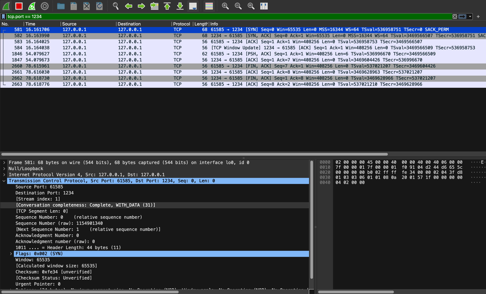

# Analysis of TCP Headers and Flags in Wireshark

**Abbas Alubeid**

**alubeid@kth.se**

## TCP Headers

At the lower left of Figure 1, the TCP headers for the initial packet are displayed, representing the client's connection request to the server, identified by the SYN (Synchronize) flag.

*Figure 1: Captured TCP traffic in a client-server connection using Wireshark.*

The header fields include:

- **Source Port**: 61585 - This is the port number of the client device from where the packet originated.
- **Destination Port**: 1234 - The port number on the destination device, the server in this case.
- **Sequence Number**: If the SYN flag is set, then this is the initial sequence number. Otherwise, it's the accumulated sequence number of the first data byte in this segment.
- **Acknowledgment Number**: If the ACK flag is set, then this field contains the value of the next sequence number that the sender of the segment is expecting to receive.
- **Flags**: Contains various control flags like SYN, ACK, PSH, etc. 

## What does flags ACK/SYN/SEQ/PSH/FIN represent?
- **SYN (Synchronize sequence numbers)** is used to initiate a connection. It specifies that the sequence number in the header is the initial sequence number.
**ACK (Acknowledgment)**: This flag is set to indicate acknowledgment. When the ACK flag is set, it confirms that the previous segments were received successfully by the receiver.
- **SEQ (Sequence Number)** is used to track the sequence of the data being transmitted over a TCP connection. It provides a way for the receiving end of the connection to know the order in which the transmitted packets should be reassembled and to detect any missing packets
- **PSH (Push)** tells the receiver to immediately pass the data to the application (buffers should be emptied).
- **FIN (Finish)** is set to indicate that the sender has finished sending, indicating the desire to terminate the connection.

## Steps and Flags Explanation from Wireshark Capture in Figure 1

### 1. Connecting to the Server

- **Lines 1 to 3**: These lines in the Wireshark capture (Figure 1) show the initial connection setup between the client and server. It's a three-way handshake:
  1. The client sends a TCP packet with the **SYN** flag set to initiate a connection.
  2. The server responds with a packet that has both the **SYN** and **ACK** flags set, indicating its acknowledgment of the client's connection request and its own desire to establish a connection.
  3. The client then acknowledges this by sending an **ACK**.

### 2. Writing a Message to the Server

- **Line 5**: The client sends a packet with both the **PSH** (Push) and **ACK** (Acknowledgment) flags set. This indicates that the client is transmitting data to the server and wants the server to process the message immediately.

- **Line 6**: The server acknowledges the receipt of the client's message by sending a packet with the **ACK** flag set.

### 3. Terminating the Connection from Client

- **Lines 7 to 10**: These lines show the termination process:
  1. The client sends a packet with the **FIN** flag to indicate it wants to terminate the connection.
   2. The server responds with a packet having both **FIN** and **ACK** flags, confirming the receipt of the client's termination request
  3. The server then sends its own **FIN** to indicate it also wants to terminate the connection, to which the client responds with an **ACK**.

