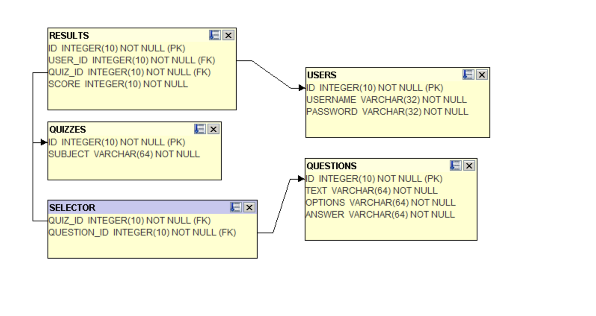

This project is part of a lab exercise where a quiz game was created using the Apache Tomcat server and Maven. The purpose of the lab is to explore concepts such as Java EE, servlets, JSP, and the MVC design pattern, alongside integrating PostgreSQL for database operations. The application features session management, database connectivity using JDBC and JPA, and handling web-based user interactions.

## Layers

### Controllers
Servlets that handle HTTP requests and responses, directing the flow of data between the View and Model layers. 
- **Example: LoginController**
  - Manages user login processes, interacting with `UserDao` from the DAO layer to validate user credentials. It directs users to the appropriate view (`login.jsp` or `quizzes.jsp`) based on authentication success or failure.

### DAOs (Data Access Objects)
DAOs provide an abstraction layer to the database, handling all data persistence operations.
- **Example: QuizDao**
  - Manages quizzes and results in the database. It interacts with the `Result` model for persisting quiz outcomes and is used by `QuizController` to fetch quiz data for display in `quizzes.jsp`.

### Models
Models represent the data structure of the application, encapsulating the business logic.
- **Example: Question**
  - Represents quiz questions, including attributes like text, options, and answers. It is used by `QuestionDao` for retrieving question data and is displayed in `quiz.jsp` by the `QuestionController`.

### Views (JSP Files)
Views are responsible for presenting data to the user in a browser-friendly format.
- **Example: quiz.jsp**
  - Displays quiz questions and collects user responses. It interacts with `QuestionController` for displaying data from `Question` models and sends user responses back to the controller for processing.

## How It Works
1. **User Authentication**: Using `login.jsp` and `LoginController`, users can log in to the system. User validation is done through `UserDao`.
2. **Quiz Interaction**: Authenticated users can view and select quizzes in `quizzes.jsp`, managed by `QuizController`.
3. **Quiz Attempt**: Users take quizzes in `quiz.jsp`. `QuestionController` is responsible for presenting questions and calculating scores.
4. **Result Management**: Quiz scores are recorded in the database using JPA, implemented in `QuizDao`.

## Database

Database schema and setup details -> [DBSetup.sql](DBSetup.sql)

### Entity-Relationship Diagram

